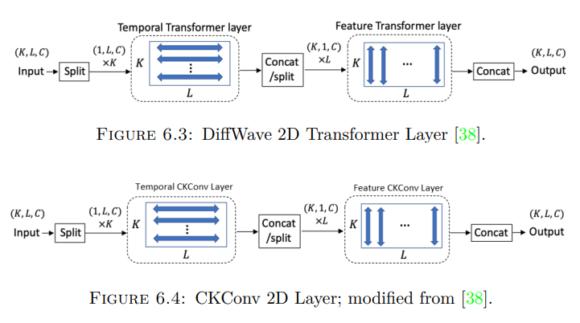
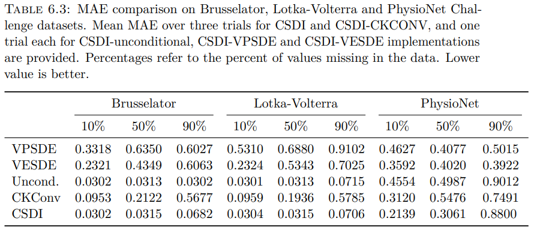
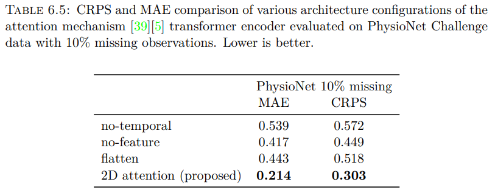
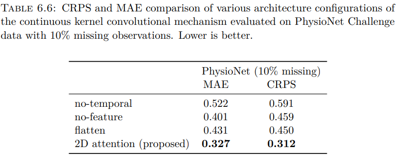

# CSDI-CKConv Framework Implementation of Score Matching for Irregularly Sampled Time Series
This is the github repository for CSDI-CKConv framework implementation of the thesis Score Matching for Irregularly Sampled Time Series.










## Requirement

Please install the packages in requirements.txt

## Preparation
### Download the healthcare dataset 
```shell
python download.py physio
```
### Download the air quality dataset 
```shell
python download.py pm25
```

## Experiments 

### training and imputation for the healthcare dataset
```shell
python exe_physio.py --testmissingratio [missing ratio] --nsample [number of samples]
```

### imputation for the healthcare dataset with pretrained model
```shell
python exe_physio.py --modelfolder pretrained --testmissingratio [missing ratio] --nsample [number of samples]
```

### training and imputation for the healthcare dataset
```shell
python exe_pm25.py --nsample [number of samples]
```

### Visualize results
'visualize_examples.ipynb' is a notebook for visualizing results.

## Acknowledgements
This codes builds on [CKConv](https://github.com/dwromero/ckconv), [CSDI](https://github.com/ermongroup/CSDI) and [DiffWave](https://github.com/lmnt-com/diffwave)
